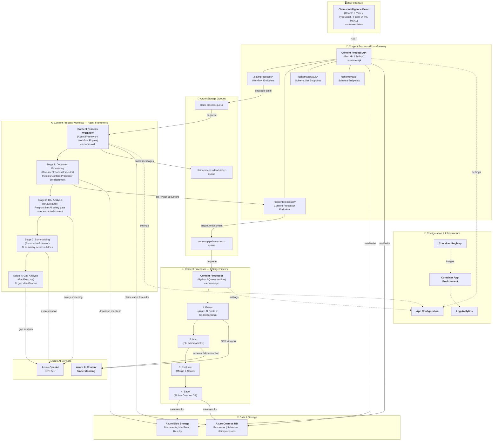
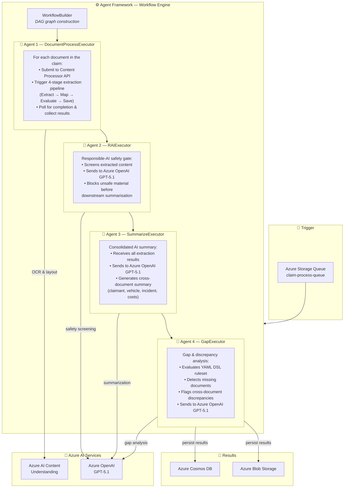

# Claims Intelligence — Multi-Document Processing Demo

> [!WARNING]
> **Experimental proof of concept — not production-ready**
>
> This project is an experimental proof of concept only and has been "vibe-coded" primarily with the assistance of GitHub Copilot. The codebase has not been fully reviewed, tested, or hardened, and should be treated as illustrative rather than production-ready.
>
> Accordingly:
> - This work is provided **"as is"**, with no warranties or guarantees of any kind.
> - There are **no assurances** regarding security, compliance, performance, scalability, reliability, or adherence to coding best practices.
> - The implementation may contain errors, vulnerabilities, incomplete logic, or non-optimal design decisions.
> - It is **not approved for production use** or deployment in any environment handling real customer data.
> - Any use, modification, or deployment is undertaken **entirely at the recipient's own risk**.
> - Anyone choosing to review, run, or extend this code is responsible for performing their own independent due diligence — including (but not limited to) security review, architecture validation, compliance checks, and alignment with internal standards and policies.
> - **AI-generated outputs (extractions, classifications, confidence scores, summaries, gap analyses, agent reasoning) may be inaccurate, incomplete, biased, or hallucinated** and must not be relied on to make decisions about real claims, customers, or other downstream actions without qualified human review. The AI safety / RAI stage in this repo is illustrative only — you can and should add additional checks, validation logic, guardrails, monitoring, evaluation harnesses, and design considerations appropriate to your use case before going anywhere near production.
> - **Exercise caution with the data you upload.** Documents are sent to Azure OpenAI / Microsoft Foundry for processing and may be persisted in Cosmos DB, Blob Storage, App Insights, and other Azure resources provisioned by this deployment. **You are responsible** for what you put in, for ensuring you have the right to process it, and for compliance with any applicable privacy, data-residency, or regulatory obligations (PII, PHI, financial, contractual confidentiality, etc.).
> - **Deploying this solution provisions paid Azure resources** (Cosmos DB, AI Search, Container Apps, Container Registry, Azure OpenAI / Foundry, App Configuration, Log Analytics, etc.) and consumes Azure OpenAI tokens on every run. **You are responsible** for all resulting Azure charges. Price a deployment with the [Azure Pricing Calculator](https://azure.microsoft.com/pricing/calculator/) against your own region and usage profile before committing to a budget.

> [!NOTE]
> This repository is derived from the upstream Microsoft `content-processing-solution-accelerator` sample and was then heavily modified into a journey-driven claims demo. Most of the changes live in the new `ContentProcessorClaimsDemo` SPA and the workflow's RAI safety stage; the underlying content-processing engine still derives from that original codebase. The MIT `LICENSE` retains Microsoft's original copyright on the upstream portions. This repository is shared in a **personal / independent capacity** and is **not** an official Microsoft product, accelerator, or supported release, nor is it produced or endorsed by Microsoft or any other organisation.

Process multi-document claims by extracting data from each document, applying schemas with confidence scoring, and generating AI-powered summaries and gap analysis across the entire claim. Upload multiple files — invoices, forms, images, contracts — to a single claim, and the solution automatically processes each document through a multi-modal content extraction pipeline, then orchestrates cross-document summarization and gap identification using an Agent Framework Workflow Engine.

The core content processing engine supports text, images, tables and graphs with schema-based transformation and confidence scoring. These capabilities can be applied to numerous use cases including: insurance claims processing, contract review, invoice processing, ID verification, and logistics shipment record processing.

---

[**SOLUTION OVERVIEW**](#solution-overview)  \| [**QUICK DEPLOY**](#quick-deploy)  \| [**BUSINESS SCENARIO**](#business-scenario)  \| [**SUPPORTING DOCUMENTATION**](#supporting-documentation)

---

 **Note:** With any AI solution you build on top of this codebase, you are responsible for assessing all associated risks and for complying with all applicable laws and safety standards. For background on the underlying components, see the transparency documents for [Agent Service](https://learn.microsoft.com/en-us/azure/ai-foundry/responsible-ai/agents/transparency-note) and [Agent Framework](https://github.com/microsoft/agent-framework/blob/main/TRANSPARENCY_FAQ.md).

## Solution overview

This solution leverages Azure AI Foundry, Azure AI Content Understanding Service, Azure OpenAI Service GPT-5.1, Azure Blob Storage, Azure Cosmos DB, and Azure Container Apps to process multi-document claims through a two-level architecture:

- **Claim Processing Workflow** — Upload multiple documents to a claim via the Web UI. The Content Process Workflow (built on the Agent Framework Workflow Engine) orchestrates document extraction, AI-powered summarization, and gap analysis across all documents in the claim.
- **Content Processing Pipeline** — The core engine (carried forward from v1) that processes each individual document through a 4-stage pipeline: Extract → Map → Evaluate → Save, with confidence scoring for extraction accuracy and schema mapping.

Processing, extraction, schema transformation, summarization, and gap analysis steps are tracked with status and scored for accuracy to automate processing and identify as-needed human validation.

### Solution architecture

Click to view detailed architecture diagram

### Agentic architecture

The claim processing workflow is built on the **Agent Framework's Workflow Engine** — a DAG-based event-streaming execution model that orchestrates specialized AI agents across the claim lifecycle. Each stage is an autonomous `Executor` that receives context, performs its task, and passes results downstream.

Click to view detailed agentic architecture diagram

| Capability              | Detail                                                                                                |
| ----------------------- | ----------------------------------------------------------------------------------------------------- |
| **Execution model**     | DAG-based workflow with event streaming, concurrent workers, and retry logic                          |
| **Agent orchestration** | `WorkflowBuilder` registers executors, defines edges, and builds a frozen `Workflow` graph            |
| **Executor pattern**    | Each agent is an `Executor` subclass with `@handler`-decorated async methods                          |
| **Fault tolerance**     | Exponential backoff retries, dead-letter queue (`claim-process-dead-letter-queue`), graceful shutdown |
| **Extensibility**       | Add new agents (executors) and edges to the DAG without modifying existing stages                     |

### Additional resources

For detailed technical information, see the component documentation:

[Technical Architecture](./docs/TechnicalArchitecture.md)

[Document Processing Pipeline (4-stage extraction)](./docs/ProcessingPipelineApproach.md)

[Claim Processing Workflow (Agent Framework)](./docs/ClaimProcessWorkflow.md)

[Golden Path Workflows (end-to-end walkthroughs)](./docs/GoldenPathWorkflows.md)

If you'd like to customize this solution, here are some common areas to start:

[Gap Analysis Ruleset Guide (YAML DSL — no-code rule authoring)](./docs/GapAnalysisRulesetGuide.md) 

[API Reference for Content Processing & Claim Management](./docs/API.md)

[Customizing the Claim Processing Workflow](./docs/ClaimProcessWorkflow.md)

---

## Features

### Key features

Click to learn more about the key features this solution enables

- **Multi-document claim processing**  
  Upload multiple files to a single claim and process them as a batch. The claim workflow orchestrates content extraction for each document, then performs cross-document summarization and gap analysis.

- **Multi-modal content processing**  
  Core extraction uses Azure AI Content Understanding `prebuilt-layout`, linked analyzers, and schema-driven field extraction for PDFs and images. Foundry vision is used as a classification safety net when Content Understanding cannot confidently route a file.

- **AI-powered summarization & gap analysis**  
  After all documents in a claim are processed, GPT-5.1 generates a consolidated summary and performs gap analysis — detecting missing documents and flagging cross-document discrepancies across the claim.

- **No-code gap analysis ruleset (YAML DSL)**  
  Gap analysis rules are defined in a reusable YAML-based Domain-Specific Language — domain experts can add, modify, or replace rules without writing code. The same DSL format is portable across industries (insurance, logistics, legal, finance). See [Gap Analysis Ruleset Guide](./docs/GapAnalysisRulesetGuide.md).

- **Agent Framework Workflow Engine**  
  Claim processing is orchestrated by a DAG-based workflow engine with event streaming, concurrent workers, retry logic, and dead-letter queue support for production reliability.

- **Schema-based data transformation**  
  Maps extracted content to custom or industry-defined schemas and outputs as JSON for interoperability.

- **Confidence scoring**  
  Calculation of entity extraction and schema mapping processes for accuracy, providing scores to drive manual human-in-the-loop review, if desired.

- **Review, validate, update**  
  Transparency in reviewing processing steps, summaries, and gap analysis — allowing for review, comparison to source asset, ability to modify output results, and annotation for historical reference.

- **API driven processing pipelines**  
  API endpoints are available for claim lifecycle management, content processing, schema management, and external source system integration.

---

## Getting Started

### Quick deploy

#### How to install or deploy

Follow the quick deploy steps on the deployment guide to deploy this solution to your own Azure subscription.

> **Note:** This solution requires **Azure Developer CLI (azd) version 1.18.0 or higher**. Please ensure you have the latest version installed before proceeding with deployment. [Download azd here](https://learn.microsoft.com/en-us/azure/developer/azure-developer-cli/install-azd).

[Click here to launch the deployment guide](./docs/DeploymentGuide.md)

> ⚠️ **Important: Check Azure OpenAI Quota Availability**  
> When you run `azd up`, the deployment will show you regions with available quota for the required `gpt-5.1` model. If your subscription is short on quota in your preferred region, request an increase in the [Azure portal quota page](https://portal.azure.com/#view/Microsoft_Azure_Quotas/QuotaMenuBlade/~/overview) before deploying.

> 🛠️ **Need Help?** Check our [Troubleshooting Guide](./docs/TroubleShootingSteps.md) for solutions to common deployment issues.

## Guidance

### Prerequisites and costs

To deploy this solution, ensure you have access to an [Azure subscription](https://azure.microsoft.com/free/) with the necessary permissions to create **resource groups, resources, app registrations, and assign roles at the resource group level**. This should include Contributor role at the subscription level and Role Based Access Control role on the subscription and/or resource group level. Follow the steps in [Azure Account Set Up](./docs/AzureAccountSetup.md).

Here are the supported regions for deployment: Australia East, Central US, East Asia, East US 2, Japan East, North Europe, Southeast Asia, UK South.

Check the [Azure Products by Region](https://azure.microsoft.com/en-us/explore/global-infrastructure/products-by-region/?products=all&regions=all) page and select a **region** where the following services are available.

Pricing varies per region and usage, so it isn't possible to predict exact costs for your usage. The majority of the Azure resources used in this infrastructure are on usage-based pricing tiers. However, Azure Container Registry has a fixed cost per registry per day.

Use the [Azure pricing calculator](https://azure.microsoft.com/en-us/pricing/calculator) to calculate the cost of this solution in your subscription.

Review a [sample pricing sheet](https://azure.com/e/0a9a1459d1a2440ca3fd274ed5b53397) in the event you want to customize and scale usage.

_Note: This is not meant to outline all costs as selected SKUs, scaled use, customizations, and integrations into your own tenant can affect the total consumption of this sample solution. The sample pricing sheet is meant to give you a starting point to customize the estimate for your specific needs._

>⚠️ **Important:** To avoid unnecessary costs, remember to take down your app if it's no longer in use, either by deleting the resource group in the Portal or running `azd down`.

## Resources

| Product | Description | Tier / Expected Usage Notes | Cost |
|---|---|---|---|
| [Azure AI Foundry](https://learn.microsoft.com/en-us/azure/ai-foundry/) | Build generative AI applications on an enterprise-grade platform | Free Tier | [Pricing](https://azure.microsoft.com/pricing/details/ai-studio/) |
| [Azure OpenAI Service](https://learn.microsoft.com/en-us/azure/ai-services/openai/) | Provides REST API access to OpenAI's powerful language models including GPT-5.1 for content extraction, summarization, and gap analysis | S0 Tier; pricing depends on token volume and model used. | [Pricing](https://azure.microsoft.com/en-us/pricing/details/cognitive-services/openai-service/) |
| [Azure AI Content Understanding Service](https://learn.microsoft.com/en-us/azure/ai-services/content-understanding/) | Analyzes various media content—such as audio, video, text, and images—transforming it into structured, searchable data | S0 Tier; pricing based on pages and transactions processed. | [Pricing](https://azure.microsoft.com/en-us/pricing/details/content-understanding/) |
| [Azure Blob Storage](https://learn.microsoft.com/en-us/azure/storage/blobs/) | Microsoft's object storage solution for the cloud. Blob storage is optimized for storing massive amounts of unstructured data | Standard Tier; pricing based on storage and transactions. | [Pricing](https://azure.microsoft.com/pricing/details/storage/blobs/) |
| [Azure Container Apps](https://learn.microsoft.com/en-us/azure/container-apps/) | Allows you to run containerized applications without worrying about orchestration or infrastructure. | Consumption plan; pricing based on vCPU and memory usage. | [Pricing](https://azure.microsoft.com/pricing/details/container-apps/) |
| [Azure Container Registry](https://learn.microsoft.com/en-us/azure/container-registry/) | Build, store, and manage container images and artifacts in a private registry for all types of container deployments | Basic Tier; fixed daily cost per registry. | [Pricing](https://azure.microsoft.com/pricing/details/container-registry/) |
| [Azure Cosmos DB](https://learn.microsoft.com/en-us/azure/cosmos-db/) | Fully managed, distributed NoSQL, relational, and vector database for modern app development | Serverless or provisioned throughput; pricing based on request units and storage. | [Pricing](https://azure.microsoft.com/en-us/pricing/details/cosmos-db/autoscale-provisioned/) |
| [Azure Queue Storage](https://learn.microsoft.com/en-us/azure/storage/queues/) | Store large numbers of messages and access messages from anywhere in the world via HTTP or HTTPS. | Standard Tier; pricing based on number of transactions. | [Pricing](https://azure.microsoft.com/en-us/pricing/details/storage/queues/) |
| [GPT Model Capacity](https://learn.microsoft.com/en-us/azure/ai-services/openai/concepts/models) | GPT-5.1 model with multimodal capabilities, accepting both text and images as input for extraction, summarization, and gap analysis | Pricing depends on token volume and model used. | [Pricing](https://azure.microsoft.com/en-us/pricing/details/cognitive-services/openai-service/) |

For detailed cost estimation and pricing information, see the [Deployment Guide](./docs/DeploymentGuide.md).

---

## Business scenario

The included sample scenario demonstrates a **First Notice of Loss (FNOL)** workflow for an auto insurance company. A claims analyst receives incoming collision claims — each containing an auto insurance claim form, police report, repair estimate, and photos of vehicle damage — that need to be processed together.

The analyst creates a claim in the system and uploads all documents. The workflow engine automatically:

1. **Extracts** structured data from each document — policyholder info, vehicle details (VIN, plate), incident description, and repair line items — using Azure AI Content Understanding linked analyzers and `prebuilt-layout` output.
2. **Summarizes** findings across the entire claim — producing a consolidated report covering claimant details, vehicle info, incident narrative, damage assessment, and estimated costs.
3. **Runs gap & discrepancy analysis** using YAML DSL rules — detecting missing documents (e.g., no police report for a theft claim, no repair estimate when the loss exceeds $2,000) and flagging cross-document discrepancies (e.g., mismatched claim numbers, VIN conflicts between the claim form and police report, or date-of-loss differences).

The analyst reviews the AI-generated summary for a quick overview, checks gap analysis results for flagged issues and discrepancies, and drills into individual document extractions when needed. What previously required hours of manual cross-referencing is now orchestrated in minutes.

> **Sample data included:** Four synthetic claim packs ship under `src/ContentProcessorAPI/samples/`: `claim_demo_persona/` (the canonical multi-document demo persona), `claim_collision_commercial_hint/` (personal-use policy with subtle TNC/ride-share usage cues — exercises gap analysis), `claim_hail_storm/` (comprehensive weather loss with multi-photo damage), and `claim_theft_vandalism/` (recovered-after-theft, non-collision). See [Golden Path Workflows](./docs/GoldenPathWorkflows.md) for a step-by-step walkthrough.

⚠️ The sample data used in this repository is synthetic and generated using Azure OpenAI service. The data is intended for use as sample data only.

### Business value

Click to learn more about what value this solution provides

- **Automated claim intake**  
  Upload claim forms, police reports, repair estimates, and damage photos to a single claim. The workflow engine orchestrates extraction, summarization, and gap analysis automatically — reducing intake processing from hours to minutes.

- **Cross-document intelligence**  
  AI-powered summarization consolidates findings across all documents in a claim, while gap analysis identifies missing documents and flags discrepancies — such as mismatched claim numbers, VIN conflicts, or date-of-loss differences between the claim form and police report.

- **No-code gap rules**  
  Gap analysis rules are defined in a YAML DSL that domain experts can modify without writing code — add required document checks, adjust severity levels, or define new discrepancy rules across industries.

- **Confidence-driven human-in-the-loop**  
  Extraction and schema mapping are scored for accuracy using dual confidence signals (OCR-level and model log-probability), so analysts can focus human review on low-confidence results while high-confidence data flows through automatically.

- **Verifiable review & audit trail**  
  Review AI-generated extractions, summaries, and gap analysis results side-by-side with source documents. Annotate changes, add comments, and compare processing steps for transparency and audit readiness.

- **Responsible AI safety gate**  
  A built-in RAI executor screens every document's extracted content against 10 safety categories — including self-harm, violence, prompt injection, and discriminatory content — before further processing, helping ensure only safe content reaches downstream workflows.

- **Schema-driven extensibility**  
  Define custom Pydantic schemas to extract structured data from any document type. The same extraction pipeline generalizes across industries — insurance, logistics, legal, finance — without code changes.

- **Production-ready orchestration**  
  The Agent Framework Workflow Engine provides DAG-based execution with event streaming, retry logic, dead-letter queues, and graceful shutdown — designed for reliable, scalable processing in production environments.

- **API-first integration**  
  All capabilities — claim lifecycle, content processing, schema management — are exposed through REST APIs, enabling integration with existing line-of-business systems, RPA workflows, and custom applications.

---

## Supporting documentation

### Security guidelines

This solution uses [Azure App Configuration](https://learn.microsoft.com/azure/azure-app-configuration/overview) for centralized configuration management and [Managed Identity](https://learn.microsoft.com/entra/identity/managed-identities-azure-resources/overview) for secure service-to-service authentication — no connection strings or secrets are stored in application code.

To maintain strong security practices, it is recommended that GitHub repositories built on this solution enable [GitHub secret scanning](https://docs.github.com/code-security/secret-scanning/about-secret-scanning) to detect accidental secret exposure.

Additional security considerations include:

- Enabling [Microsoft Defender for Cloud](https://learn.microsoft.com/azure/security-center/defender-for-cloud) to monitor and secure Azure resources.
- Using [Virtual Networks](https://learn.microsoft.com/azure/container-apps/networking?tabs=workload-profiles-env%2Cazure-cli) or [firewall rules](https://learn.microsoft.com/azure/container-apps/waf-app-gateway) to protect Azure Container Apps from unauthorized access.
- Implementing authentication and authorization for the frontend application using Microsoft Entra ID or other identity providers.

 

## Provide feedback

Have questions, find a bug, or want to request a feature? Open an issue on this repository.

## Responsible AI Transparency FAQ

Please refer to [Transparency FAQ](./TRANSPARENCY_FAQ.md) for responsible AI transparency details of this solution.

## Disclaimers

To the extent that the Software includes components or code used in or derived from Microsoft products or services, including without limitation Microsoft Azure Services (collectively, "Microsoft Products and Services"), you must also comply with the Product Terms applicable to such Microsoft Products and Services. You acknowledge and agree that the license governing the Software does not grant you a license or other right to use Microsoft Products and Services. Nothing in the license or this ReadMe file will serve to supersede, amend, terminate or modify any terms in the Product Terms for any Microsoft Products and Services.

You must also comply with all domestic and international export laws and regulations that apply to the Software, which include restrictions on destinations, end users, and end use. For further information on export restrictions, visit https://aka.ms/exporting.

You acknowledge that the Software and Microsoft Products and Services (1) are not designed, intended or made available as a medical device(s), and (2) are not designed or intended to be a substitute for professional medical advice, diagnosis, treatment, or judgment and should not be used to replace or as a substitute for professional medical advice, diagnosis, treatment, or judgment. Customer is solely responsible for displaying and/or obtaining appropriate consents, warnings, disclaimers, and acknowledgements to end users of Customer's implementation of the Online Services.

You acknowledge the Software is not subject to SOC 1 and SOC 2 compliance audits. No Microsoft technology, nor any of its component technologies, including the Software, is intended or made available as a substitute for the professional advice, opinion, or judgement of a certified financial services professional. Do not use the Software to replace, substitute, or provide professional financial advice or judgment.

BY ACCESSING OR USING THE SOFTWARE, YOU ACKNOWLEDGE THAT THE SOFTWARE IS NOT DESIGNED OR INTENDED TO SUPPORT ANY USE IN WHICH A SERVICE INTERRUPTION, DEFECT, ERROR, OR OTHER FAILURE OF THE SOFTWARE COULD RESULT IN THE DEATH OR SERIOUS BODILY INJURY OF ANY PERSON OR IN PHYSICAL OR ENVIRONMENTAL DAMAGE (COLLECTIVELY, "HIGH-RISK USE"), AND THAT YOU WILL ENSURE THAT, IN THE EVENT OF ANY INTERRUPTION, DEFECT, ERROR, OR OTHER FAILURE OF THE SOFTWARE, THE SAFETY OF PEOPLE, PROPERTY, AND THE ENVIRONMENT ARE NOT REDUCED BELOW A LEVEL THAT IS REASONABLY, APPROPRIATE, AND LEGAL, WHETHER IN GENERAL OR IN A SPECIFIC INDUSTRY. BY ACCESSING THE SOFTWARE, YOU FURTHER ACKNOWLEDGE THAT YOUR HIGH-RISK USE OF THE SOFTWARE IS AT YOUR OWN RISK.
