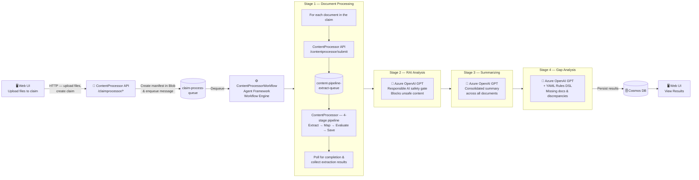
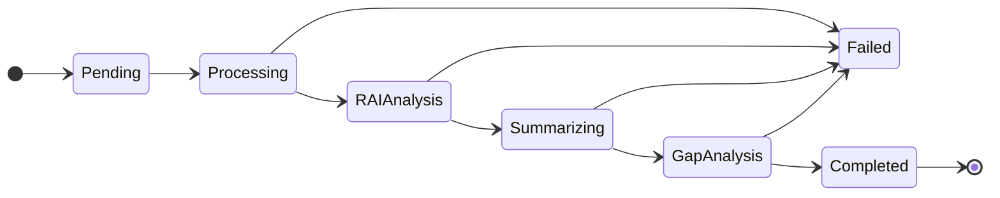

# Claim Processing Workflow

This document describes the claim processing workflow — the v2 orchestration layer that drives the end-to-end user experience. The workflow is implemented in the **ContentProcessorWorkflow** service using an **Agent Framework's Workflow Engine**, a DAG-based event-streaming execution model.

> For the individual document extraction pipeline (Extract → Map → Evaluate → Save), see [Processing Pipeline Approach](./ProcessingPipelineApproach.md).

---

## End-to-End Flow



### Key Interaction Points

| Step | Actor                                                  | Target                | Mechanism                                                                         |
| ---- | ------------------------------------------------------ | --------------------- | --------------------------------------------------------------------------------- |
| 1    | **Web UI**                                             | ContentProcessor API  | HTTP — upload files, create claim, start processing                               |
| 2    | **ContentProcessor API**                               | Azure Storage Queue   | Enqueues message to `claim-process-queue`                                         |
| 3    | **ContentProcessorWorkflow**                           | Azure Storage Queue   | Dequeues from `claim-process-queue`                                               |
| 4    | **ContentProcessorWorkflow** (DocumentProcessExecutor) | ContentProcessor API  | HTTP — submits each document via `/contentprocessor/submit`, polls for completion |
| 5    | **ContentProcessor API**                               | Azure Storage Queue   | Enqueues to `content-pipeline-extract-queue`                                      |
| 6    | **ContentProcessor**                                   | Azure Storage Queue   | Dequeues from `content-pipeline-extract-queue`, runs 4-stage pipeline             |
| 7    | **ContentProcessorWorkflow** (RAIExecutor)             | Azure OpenAI GPT-5.1  | Responsible AI safety check — blocks pipeline if content is unsafe                |
| 8    | **ContentProcessorWorkflow** (SummarizeExecutor)       | Azure OpenAI GPT-5.1  | Generates summary from extraction results                                         |
| 9    | **ContentProcessorWorkflow** (GapExecutor)             | Azure OpenAI GPT-5.1  | Performs gap analysis from extraction results                                     |
| 10   | **ContentProcessorWorkflow**                           | Azure Cosmos DB       | Persists claim results (status, summary, gaps)                                    |

---

## Agent Framework Workflow Engine

The ContentProcessorWorkflow is built on the **Agent Framework** — a DAG-based workflow engine with an event-streaming execution model. This is distinct from the simple sequential pipeline used in ContentProcessor.

### WorkflowBuilder API

The framework provides a fluent builder API for constructing workflow graphs:

```python
from agent_framework import WorkflowBuilder, Workflow

workflow: Workflow = (
    WorkflowBuilder()
    .register_executor(lambda: DocumentProcessExecutor(...), name="document_processing")
    .register_executor(lambda: RAIExecutor(...),             name="rai_analysis")
    .register_executor(lambda: SummarizeExecutor(...),       name="summarizing")
    .register_executor(lambda: GapExecutor(...),             name="gap_analysis")
    .set_start_executor("document_processing")
    .add_edge("document_processing", "rai_analysis")
    .add_edge("rai_analysis", "summarizing")
    .add_edge("summarizing", "gap_analysis")
    .build()
)
```

| Method                             | Purpose                                                                               |
| ---------------------------------- | ------------------------------------------------------------------------------------- |
| `register_executor(factory, name)` | Registers a lazy factory that produces an `Executor` subclass, keyed by a string name |
| `set_start_executor(name)`         | Designates the entry-point node in the DAG                                            |
| `add_edge(source, target)`         | Defines a directed edge — output of `source` flows to `target`                        |
| `build()`                          | Validates the graph and returns a frozen `Workflow` object                            |

### Executor Pattern

Each stage is an `Executor` subclass with a `@handler`-decorated async method:

```python
from agent_framework import Executor, WorkflowContext, handler

class SummarizeExecutor(Executor):
    @handler
    async def run(self, context: WorkflowContext, input_data: str) -> None:
        # ... process input_data ...
        await context.send("summarizing", result)   # forward to next executor
        # OR
        await context.emit(final_result)            # emit final workflow output
```

| Context Method             | Purpose                                                                   |
| -------------------------- | ------------------------------------------------------------------------- |
| `context.send(name, data)` | Forwards data to the **next executor** in the edge graph                  |
| `context.emit(data)`       | Emits **final workflow output** (only the last executor should call this) |
| `context.state`            | Shared key-value store visible across all executors in the same run       |

### Event Streaming

The workflow emits events during execution that are used for status tracking:

| Event                    | When Fired            | Used For                                                                   |
| ------------------------ | --------------------- | -------------------------------------------------------------------------- |
| `WorkflowStartedEvent`   | Workflow begins       | Initialize claim status                                                    |
| `ExecutorInvokedEvent`   | An executor starts    | Update Cosmos DB status (e.g., `Processing`, `Summarizing`, `GapAnalysis`) |
| `ExecutorCompletedEvent` | An executor finishes  | Log completion, timing                                                     |
| `ExecutorFailedEvent`    | An executor errors    | Mark claim as `Failed`, store error message                                |
| `WorkflowOutputEvent`    | Final output produced | Mark claim as `Completed`                                                  |
| `WorkflowFailedEvent`    | Workflow fails        | Mark claim as `Failed`                                                     |

---

## Four Workflow Stages

### Stage 1: Document Processing (`DocumentProcessExecutor`)

**Purpose**: Submit all documents in the claim to ContentProcessor (via the API) and collect extraction results.

**Steps**:
1. Downloads the claim manifest (JSON) from Azure Blob Storage (`process-batch` container)
2. Creates a `claimprocess` record in Cosmos DB with status `Pending`
3. For each document in the manifest (concurrently, up to 4):
   - Downloads the file from blob storage
   - POSTs it to ContentProcessor API (`/contentprocessor/submit`) with schema assignment
   - ContentProcessor API enqueues to `content-pipeline-extract-queue`
   - ContentProcessor picks up the message and runs the 4-stage pipeline (Extract → Map → Evaluate → Save)
   - Polls the API `Operation-Location` URL until terminal status
   - Fetches final output with extraction score and schema score
   - Upserts per-file result records into Cosmos DB
4. Aggregates all document results and forwards to the next stage

### Stage 2: RAI Analysis (`RAIExecutor`)

**Purpose**: Responsible AI safety gate — screen all extracted document content against safety rules before further processing.

**Steps**:
1. Reads document processing results from the shared workflow context
2. For each successfully processed document:
   - **PDFs**: Fetches extraction steps and extracts markdown content
   - **Images** (PNG/JPG): Fetches map steps and extracts mapped content
3. Concatenates all document text and sends to an LLM-based safety classifier
4. Loads the RAI prompt template (from `src/ContentProcessorWorkflow/src/steps/rai/prompt/`)
5. Invokes Azure OpenAI GPT-5.1 (temperature=0.1, top_p=0.1) with structured `RAIResponse` output
6. If content is flagged as unsafe (`IsNotSafe == true`), **halts the workflow** with an error — the claim is marked `Failed`
7. If content passes, forwards result to the next stage

**Safety Rules**: The classifier evaluates content against 10 rules covering self-harm, violence, illegal activities, discrimination, sexual content, medical information, profanity, prompt injection, embedded system commands, and spam. Rules are defined in the prompt template at `src/ContentProcessorWorkflow/src/steps/rai/prompt/rai_executor_prompt.txt` and can be customized by editing that file.

### Stage 3: Summarizing (`SummarizeExecutor`)

**Purpose**: Generate an AI-powered consolidated summary across all processed documents.

**Steps**:
1. Reads document processing results from the shared workflow context
2. For each successfully processed document:
   - **PDFs**: Fetches extraction steps and extracts markdown content
   - **Images** (PNG/JPG): Fetches map steps and extracts mapped content
3. Builds a chat message with a prompt template (from `src/ContentProcessorWorkflow/src/steps/summarize/prompt/`)
4. Invokes Azure OpenAI GPT-5.1 (temperature=0.1, top_p=0.1) for deterministic output
5. Persists the summary to Cosmos DB
6. Forwards result to the next stage

### Stage 4: Gap Analysis (`GapExecutor`)

**Purpose**: Perform gap analysis across all claim documents — identifying missing/insufficient documents and flagging cross-document discrepancies.

**Steps**:
1. Reads document processing results from the shared workflow context
2. Carries the intake classification document type as the authoritative document inventory for required-document checks
3. Fetches full processed JSON for each completed document
4. Loads a prompt template and injects **YAML rules DSL** (gap analysis rules)
5. Invokes Azure OpenAI GPT-5.1 with the rule-injected prompt
6. Persists gap analysis results to Cosmos DB
7. Emits the final workflow output (terminates the pipeline)

**DSL-Based Ruleset**: Gap analysis rules — both missing document checks and cross-document discrepancy detection — are defined in a reusable YAML-based Domain-Specific Language (DSL), not hard-coded in Python. Domain experts can add, modify, or replace gap rules and cross-document discrepancy checks by editing a single YAML file. The same DSL format is portable across industries (insurance, logistics, legal, finance). For a comprehensive guide on the DSL structure, expression language, and how to adapt it for other domains, see [Gap Analysis Ruleset Guide](./GapAnalysisRulesetGuide.md).

---

## Queue-Driven Execution Model

### Queue Architecture

| Queue                             | Purpose                                | Producer               | Consumer               |
| --------------------------------- | -------------------------------------- | ---------------------- | ---------------------- |
| `claim-process-queue`             | Claim workflow requests                | ContentProcessor API   | ContentProcessorWorkflow |
| `claim-process-dead-letter-queue` | Failed messages after retry exhaustion | ContentProcessorWorkflow | Manual / ops review    |
| `content-pipeline-extract-queue`  | Individual document extraction jobs    | ContentProcessor API   | ContentProcessor       |

### Polling & Concurrency

- **Long-poll loop**: Each worker continuously polls the queue with configurable intervals
- **Concurrent workers**: `CONCURRENT_WORKERS` async worker loops (default: 1), each processes one claim at a time
- **Poll interval**: `POLL_INTERVAL_SECONDS` (default: 5s) sleep when no messages
- **Visibility timeout**: `VISIBILITY_TIMEOUT_MINUTES` (default: 30 min) — renewed at ~60% interval to prevent re-delivery during long processing

### Retry & Dead-Letter Logic

| Scenario                             | Behavior                                                                                                        |
| ------------------------------------ | --------------------------------------------------------------------------------------------------------------- |
| Attempt < max retries (default: 3)   | Visibility timeout shortened to `RETRY_VISIBILITY_DELAY_SECONDS` (default: 5s), message re-enters queue quickly |
| Final attempt (dequeue count ≥ max)  | Payload sent to `claim-process-dead-letter-queue`, output blobs cleaned up, original message deleted            |
| Dead-letter send fails               | Original message visibility extended (≥60s); message is **NOT deleted** to prevent silent data loss             |
| Malformed messages                   | Immediately dead-lettered regardless of attempt count                                                           |
| Process termination (SIGINT/SIGTERM) | Queue message deleted, output blobs cleaned up, task cancelled gracefully                                       |

---

## Status Tracking

Claim processing status is tracked in Cosmos DB (`claimprocesses` collection) through these stages:



| Status        | When Set                                         | By                                       |
| ------------- | ------------------------------------------------ | ---------------------------------------- |
| `Pending`     | Claim created, message enqueued                  | ContentProcessor API                     |
| `Processing`  | `ExecutorInvokedEvent` for `document_processing` | DocumentProcessExecutor                  |
| `RAIAnalysis` | `ExecutorInvokedEvent` for `rai_analysis`        | RAIExecutor                              |
| `Summarizing` | `ExecutorInvokedEvent` for `summarizing`         | SummarizeExecutor                        |
| `GapAnalysis` | `ExecutorInvokedEvent` for `gap_analysis`        | GapExecutor                              |
| `Completed`   | `WorkflowOutputEvent` received                   | Workflow engine                          |
| `Failed`      | `ExecutorFailedEvent` or `WorkflowFailedEvent`   | Workflow engine (+ error message stored) |

Processing duration (elapsed wall-clock time) is always persisted in the `finally` block.

---

## Related Documentation

- [Processing Pipeline Approach](./ProcessingPipelineApproach.md) – 4-stage document extraction pipeline (Extract → Map → Evaluate → Save)
- [Gap Analysis Ruleset Guide](./GapAnalysisRulesetGuide.md) – YAML DSL reference for no-code gap rule authoring and domain adaptation
- [API Documentation](./API.md) – Full API endpoint reference including Claim Processor and Content Processor
- [Technical Architecture](./TechnicalArchitecture.md) – Solution-level architecture overview
- Modify RAI, summarize, and gap analysis prompt templates directly in `src/ContentProcessorWorkflow/src/steps/{rai,summarize,gap_analysis}/prompt/*.txt`
- [Troubleshooting](./TroubleShootingSteps.md) – Claim processing and workflow troubleshooting entries
