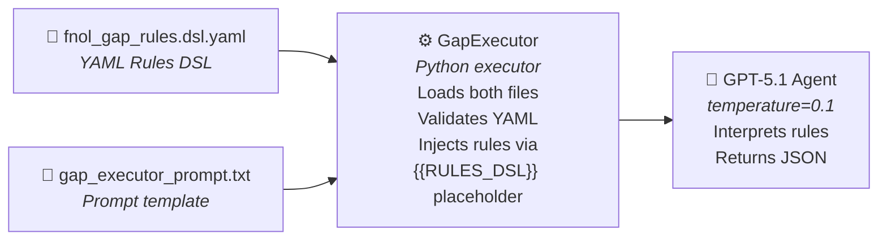

# Gap Analysis Ruleset Guide

The gap analysis stage performs two types of checks in a single pass: **missing document detection** (are all required documents present?) and **cross-document discrepancy finding** (do field values agree across documents?). Both are driven by a **YAML-based Domain-Specific Language (DSL)** — no code changes required. Domain experts (claims adjusters, compliance officers, operations managers) can add, modify, or replace rules by editing a single YAML file. The same DSL format can be reused across different industries and use cases.

> This guide covers the ruleset DSL. For the overall workflow architecture, see [Claim Processing Workflow](./ClaimProcessWorkflow.md).

---

## Why a DSL?

| Benefit                     | Description                                                                                                                                                 |
| --------------------------- | ----------------------------------------------------------------------------------------------------------------------------------------------------------- |
| **No-code rule authoring**  | Domain experts write YAML — no Python, no deployments for rule changes                                                                                      |
| **Reusable across domains** | Swap the rules file for logistics, legal, finance, or any document-centric workflow                                                                         |
| **Transparent & auditable** | Rules are human-readable, version-controlled, and reviewable in pull requests                                                                               |
| **LLM-interpreted**         | The YAML is injected directly into the GPT system prompt — the LLM applies the rules at inference time, so rule logic doesn't need a programmatic evaluator |
| **Separation of concerns**  | Business policy lives in YAML; execution plumbing lives in Python                                                                                           |

---

## Architecture



**File locations**:
- Rules DSL: `/src/ContentProcessorWorkflow/src/steps/gap_analysis/prompt/fnol_gap_rules.dsl.yaml`
- Prompt template: `/src/ContentProcessorWorkflow/src/steps/gap_analysis/prompt/gap_executor_prompt.txt`
- Executor: `/src/ContentProcessorWorkflow/src/steps/gap_analysis/executor/gap_executor.py`

---

## DSL Structure

The YAML DSL has five top-level sections:

```yaml
dsl_version: 1                    # DSL schema version
rule_set_id: fnol-gap-rules       # Unique rule-set identifier
version: 0.1.0                    # SemVer for this rule set
owner: "Claims Ops + Compliance"  # Human contact / team
description: "..."                # Plain-English description

document_types:       # Registry of document types & their schemas
inputs:               # Canonical fields the LLM infers from documents
required_documents:   # Gap rules — conditional checks for missing/insufficient documents
discrepancy_checks:   # Gap rules — cross-document consistency and conflict detection
observation_triggers: # Informational findings — noteworthy items that are not formal gaps
```

### 1. Metadata

```yaml
dsl_version: 1
rule_set_id: fnol-gap-rules
version: 0.2.0
owner: "Claims Ops + Compliance"
description: "Human-friendly DSL for FNOL GAP requirements and discrepancy checks."
```

| Field         | Purpose                                               |
| ------------- | ----------------------------------------------------- |
| `dsl_version` | Tracks DSL schema version for backward compatibility  |
| `rule_set_id` | Unique identifier for this rule set                   |
| `version`     | SemVer — increment when rules change                  |
| `owner`       | Team or contact responsible for maintaining the rules |
| `description` | Human-readable summary                                |

### 2. Document Types

Maps logical document type keys to the extraction schemas used by ContentProcessor.

```yaml
document_types:
  claim_form:
    requirement_type: claim_form
    schema: AutoInsuranceClaimForm
  police_report:
    requirement_type: police_report
    schema: PoliceReportDocument
  repair_estimate:
    requirement_type: repair_estimate
    schema: RepairEstimateDocument
  damage_photo:
    requirement_type: damage_photo
    schema: DamagedVehicleImageAssessment
```

| Field                    | Purpose                                                     |
| ------------------------ | ----------------------------------------------------------- |
| Key (e.g., `claim_form`) | Logical name used in rule `require:` and `sources:` clauses |
| `requirement_type`       | Canonical type string for matching                          |
| `schema`                 | Maps to the ContentProcessor extraction schema name         |

**To add a new document type**, add a new entry here and reference it in your rules.

### 3. Inputs (Canonical Fields)

Defines the strict set of fields the LLM must infer from the extracted documents. These fields drive the `when` conditions in gap rules.

```yaml
inputs:
  loss_type:
    type: enum
    allowed: [collision, theft, vehicle_theft, burglary, vandalism, hail, fire, glass, other, unknown]
    meaning: "Primary category of loss. Use 'unknown' if not supported by evidence."
  jurisdiction:
    type: us_state_code
    meaning: "Two-letter state code (e.g., CA, GA). Use 'unknown' if not supported by evidence."
  loss_amount:
    type: number
    meaning: "Best available estimate of loss/repair amount in USD (prefer repair_estimate totals)."
  has_injuries:
    type: boolean_or_unknown
    meaning: "Whether injuries are indicated. If not stated, use unknown."
  involves_third_party:
    type: boolean_or_unknown
    meaning: "Whether another driver/vehicle/party is involved. If unclear, use unknown."
  photos_provided_count:
    type: integer
    meaning: "Count of provided damage photos."
```

| Field     | Purpose                                                                          |
| --------- | -------------------------------------------------------------------------------- |
| `type`    | One of: `enum`, `us_state_code`, `number`, `boolean_or_unknown`, `integer`       |
| `allowed` | (for `enum`) Exhaustive list of valid values                                     |
| `meaning` | Natural-language description — this text is read by the LLM to understand intent |

**Key design**: The LLM **infers** these values from the extracted schema outputs. If a value isn't supported by evidence, the LLM sets it to `"unknown"` or `null`.

### 4. Required Documents (Missing Document Rules)

Conditional rules that flag gaps when a required document type is missing or insufficient.

```yaml
required_documents:
  - id: REQ-CLAIM-FORM-000
    name: "Claim document required"
    when: "loss_type exists"
    require:
      - type: claim_form
        min_count: 1
    severity: high
    rationale: "Claim document is required to create and validate the FNOL claim."

  - id: REQ-PR-THEFT-001
    name: "Police report required for theft"
    when: "loss_type in [theft, vehicle_theft, burglary]"
    require:
      - type: police_report
        min_count: 1
    severity: high
    rationale: "Police report required for theft-related losses."

  - id: REQ-PHOTO-COLLISION-002
    name: "Damage photo required for collision"
    when: "loss_type == collision and photos_provided_count < 1"
    require:
      - type: damage_photo
        min_count: 1
    severity: medium
    rationale: "At least one damage photo is required to support collision claims."

  - id: REQ-ESTIMATE-AMOUNT-003
    name: "Repair estimate required above threshold"
    when: "loss_amount >= 2000"
    require:
      - type: repair_estimate
        min_count: 1
    severity: high
    rationale: "Repair estimate required when loss amount is at or above $2,000."

  - id: REQ-MED-INJURY-004
    name: "Medical report required when injuries present"
    when: "has_injuries == true"
    require:
      - type: medical_report
        min_count: 1
    severity: high
    rationale: "Medical report required when injuries are indicated."

  - id: REQ-ID-JURISDICTION-CA-005
    name: "ID verification required in CA for third party involvement"
    when: "jurisdiction == CA and involves_third_party == true"
    require:
      - type: id_verification
        min_count: 1
    severity: high
    rationale: "ID verification required for CA claims involving third parties."

  - id: REQ-PR-THIRD-PARTY-006
    name: "Police report required when third party involved"
    when: "involves_third_party == true"
    require:
      - type: police_report
        min_count: 1
    severity: high
    rationale: "Police report required when third party involvement is indicated."
```

| Field                 | Type    | Purpose                                                                |
| --------------------- | ------- | ---------------------------------------------------------------------- |
| `id`                  | string  | Unique rule ID (convention: `REQ-<ABBREV>-<NUM>`)                      |
| `name`                | string  | Human-readable rule name                                               |
| `when`                | string  | Condition expression (see [Expression Language](#expression-language)) |
| `require`             | list    | Document types + minimum counts needed                                 |
| `require[].type`      | string  | References a key from `document_types`                                 |
| `require[].min_count` | integer | Minimum number of documents of that type                               |
| `severity`            | enum    | `critical` \| `high` \| `medium` \| `low`                              |
| `rationale`           | string  | Why the rule exists — included in the gap analysis output              |

### 5. Discrepancy Checks (Cross-Document Conflict Rules)

Rules that flag gaps when field values conflict across multiple document types.

```yaml
discrepancy_checks:
  - id: DISC-CLAIM-NUMBER-001
    field: claim_number
    sources: [claim_form, police_report, repair_estimate]
    check_type: conflict
    severity: critical
    rationale: "Claim number should match across all documents when present."

  - id: DISC-CLAIM-NUMBER-002
    field: claim_number
    sources: [claim_form, police_report, repair_estimate]
    check_type: existence
    severity: medium
    rationale: "Claim number should exist in at least one document for tracking purposes."

  - id: DISC-POLICY-NUMBER-001
    field: policy_number
    sources: [claim_form, police_report, repair_estimate]
    check_type: conflict
    severity: critical
    rationale: "Policy number should match across all documents when present."

  - id: DISC-DATE-OF-LOSS-001
    field: date_of_loss
    sources: [claim_form, police_report]
    check_type: conflict
    severity: high
    rationale: "Date of loss should be consistent across authoritative sources."

  - id: DISC-VEHICLE-VIN-001
    field: vin
    sources: [claim_form, police_report, repair_estimate]
    check_type: conflict
    severity: critical
    rationale: "VIN identifies the vehicle and should match when present."

  - id: DISC-VEHICLE-PLATE-001
    field: license_plate
    sources: [claim_form, police_report, repair_estimate, damage_photo]
    check_type: conflict
    severity: medium
    rationale: "Plate can be missing/masked but should not conflict when present."

  - id: DISC-ESTIMATE-TOTAL-001
    field: total_estimate
    sources: [claim_form, repair_estimate]
    check_type: conflict
    severity: low
    tolerance: 50
    rationale: "Totals may differ slightly; flag only material differences."

  - id: DISC-DAMAGE-DESCRIPTION-001
    field: damage_description
    sources: [claim_form, repair_estimate, damage_photo]
    check_type: conflict
    severity: low
    rationale: "Damage descriptions should be broadly consistent. Flag if documents describe damage in contradictory areas or types (e.g., front damage vs rear damage), not minor wording differences."
```

| Field        | Type              | Purpose                                                              |
| ------------ | ----------------- | -------------------------------------------------------------------- |
| `id`         | string            | Unique check ID (convention: `DISC-<FIELD>-<NUM>`)                   |
| `field`      | string            | The data field to compare across documents                           |
| `sources`    | list              | Which document types to compare                                      |
| `check_type` | enum              | `conflict` (values differ) \| `existence` (field absent everywhere)  |
| `severity`   | enum              | `critical` \| `high` \| `medium` \| `low`                            |
| `tolerance`  | number (optional) | Numeric tolerance for fuzzy matching (e.g., `50` for dollar amounts) |
| `rationale`  | string            | Why the check matters                                                |

### 6. Observation Triggers (Informational Findings)

Observation triggers are **not formal gaps or discrepancies** — they are noteworthy findings the agent surfaces as informational items. They help adjusters identify things that may need follow-up but do not constitute policy violations.

```yaml
observation_triggers:
  - id: OBS-NO-ESTIMATE-001
    name: "No repair estimate available"
    when: "loss_amount == null or loss_amount == unknown"
    severity: info
    rationale: "No repair estimate or loss amount is available. Adjuster may need to arrange an estimate before claim can proceed."

  - id: OBS-UNKNOWN-INJURIES-001
    name: "Injury status undetermined"
    when: "has_injuries == unknown"
    severity: info
    rationale: "Injury status could not be determined from available documents. Adjuster should confirm with claimant."

  - id: OBS-MISSING-DEDUCTIBLE-001
    name: "Deductible information not provided"
    when: "always"
    check: "deductible field is null or absent in claim_form"
    severity: info
    rationale: "Deductible amount is not stated in the documents. Coverage verification needed before payment calculation."

  - id: OBS-PHOTO-EXTRA-DAMAGE-001
    name: "Photos show damage not described in claim form"
    when: "photos_provided_count >= 1"
    check: "damage_photo documents describe damage areas or types not mentioned in claim_form damage description"
    severity: info
    rationale: "Damage visible in photos may exceed what was described in the claim form. Adjuster should verify full scope of damage."
```

| Field       | Type              | Purpose                                                                    |
| ----------- | ----------------- | -------------------------------------------------------------------------- |
| `id`        | string            | Unique ID (convention: `OBS-<TOPIC>-<NUM>`)                                |
| `name`      | string            | Human-readable trigger name                                                |
| `when`      | string            | Condition expression (or `"always"` for unconditional checks)              |
| `check`     | string (optional) | Natural-language instruction for the LLM when `when` alone is insufficient |
| `severity`  | enum              | Typically `info` — informational observations                              |
| `rationale` | string            | Explanation included in the output observations                            |

> **Note**: Observation triggers appear in a separate `"observations"` array in the gap analysis output, distinct from gaps and discrepancies.

---

## Expression Language

The `when` field in gap rules uses a lightweight expression mini-language:

| Pattern                | Example                                                | Meaning                       |
| ---------------------- | ------------------------------------------------------ | ----------------------------- |
| `<field> exists`       | `loss_type exists`                                     | Field is present and not null |
| `<field> == <value>`   | `loss_type == collision`                               | Exact equality                |
| `<field> in [a, b, c]` | `loss_type in [theft, vehicle_theft, burglary]`        | Membership in a set           |
| `<field> >= <number>`  | `loss_amount >= 2000`                                  | Numeric greater-than-or-equal |
| `<field> < <number>`   | `photos_provided_count < 1`                            | Numeric less-than             |
| Compound (`and`)       | `loss_type == collision and photos_provided_count < 1` | Both conditions must be true  |

> **How it works**: These expressions are **not parsed programmatically**. They are passed to the GPT-5.1 agent as part of the system prompt, and the LLM interprets and applies them against the inferred input fields. This means you can write natural, readable conditions without needing a custom parser.

---

## Adapting for Other Domains

The DSL format is intentionally domain-agnostic. To apply it to a different use case:

### Step 1: Create a New Rules File

Create a new `.dsl.yaml` file with domain-specific content. Examples:

**Logistics — Shipment Verification**
```yaml
dsl_version: 1
rule_set_id: shipment-verification-gap-rules
version: 0.1.0
owner: "Logistics Operations"
description: "Gap rules for shipment document verification."

document_types:
  bill_of_lading:
    requirement_type: bill_of_lading
    schema: BillOfLadingDocument
  commercial_invoice:
    requirement_type: commercial_invoice
    schema: CommercialInvoiceDocument
  packing_list:
    requirement_type: packing_list
    schema: PackingListDocument

inputs:
  shipment_type:
    type: enum
    allowed: [domestic, international, hazardous, perishable, unknown]
    meaning: "Type of shipment."
  declared_value:
    type: number
    meaning: "Total declared value of the shipment in USD."

required_documents:
  - id: REQ-BOL-001
    name: "Bill of lading required"
    when: "shipment_type exists"
    require:
      - type: bill_of_lading
        min_count: 1
    severity: high
    rationale: "Bill of lading is required for all shipments."

  - id: REQ-INV-001
    name: "Commercial invoice required for international shipments"
    when: "shipment_type == international"
    require:
      - type: commercial_invoice
        min_count: 1
    severity: high
    rationale: "International shipments require a commercial invoice for customs clearance."

discrepancy_checks:
  - id: DISC-TRACKING-001
    field: tracking_number
    sources: [bill_of_lading, commercial_invoice, packing_list]
    severity: critical
    rationale: "Tracking number should match across all shipment documents."
```

**Contract Review**
```yaml
dsl_version: 1
rule_set_id: contract-review-gap-rules
version: 0.1.0
owner: "Legal Operations"
description: "Gap rules for contract document package verification."

document_types:
  master_agreement:
    requirement_type: master_agreement
    schema: MasterServiceAgreement
  amendment:
    requirement_type: amendment
    schema: ContractAmendment
  certificate_of_insurance:
    requirement_type: certificate_of_insurance
    schema: CertificateOfInsurance

inputs:
  contract_value:
    type: number
    meaning: "Total contract value in USD."
  requires_insurance:
    type: boolean_or_unknown
    meaning: "Whether the contract requires proof of insurance."

required_documents:
  - id: REQ-COI-001
    name: "Certificate of insurance required"
    when: "requires_insurance == true"
    require:
      - type: certificate_of_insurance
        min_count: 1
    severity: high
    rationale: "Contracts requiring insurance must include a valid certificate."

discrepancy_checks:
  - id: DISC-CONTRACT-NUM-001
    field: contract_number
    sources: [master_agreement, amendment]
    severity: critical
    rationale: "Contract number must match across master agreement and amendments."
```

### Step 2: Register Matching Schemas

For each `schema:` value in your rules, the corresponding extraction schema must exist in the `Schemas` Cosmos container (registered via the post-deployment script in `infra/scripts/`).

### Step 3: Update the Rules File Reference

In `gap_executor.py`, change the `_RULES_FILE_NAME` constant to point to your new file:

```python
class GapExecutor(Executor):
    _RULES_FILE_NAME = "patient_intake_gap_rules.dsl.yaml"  # changed from fnol
```

Or, for a more dynamic approach, load the file name from App Configuration so rules can be swapped without redeployment.

### Step 4: Customize the Prompt Template (Optional)

The prompt template (`gap_executor_prompt.txt`) is domain-neutral by default. If your domain requires specific output formatting or refusal conditions, edit the `YOUR JOB` and `REFUSAL CONDITIONS` sections of the prompt.

---

## Writing Effective Rules

### ID Conventions

| Rule Type         | Convention              | Example                |
| ----------------- | ----------------------- | ---------------------- |
| Required document | `REQ-<ABBREV>-<NUMBER>` | `REQ-PR-THEFT-001`     |
| Discrepancy check | `DISC-<FIELD>-<NUMBER>` | `DISC-VEHICLE-VIN-001` |

### Severity Guidelines

| Severity   | When to Use                                              | Example                            |
| ---------- | -------------------------------------------------------- | ---------------------------------- |
| `critical` | Missing/conflicting data that blocks processing entirely | Mismatched claim numbers           |
| `high`     | Regulatory or compliance requirement                     | Police report for theft claims     |
| `medium`   | Best-practice recommendation                             | Damage photos for collision claims |
| `low`      | Nice-to-have or minor inconsistency                      | Slight total estimate difference   |

### Tips

- **Keep `when` expressions simple** — the LLM handles the logic, but simpler expressions produce more reliable results
- **Use `rationale`** generously — it appears in the gap analysis output and helps end users understand why a gap was flagged
- **Test incrementally** — add one rule at a time and verify with sample claims
- **Leverage `tolerance`** in discrepancy checks for numeric fields that may legitimately differ by small amounts
- **Version your rules** — use the `version` field and commit changes alongside code changes for full traceability

---

## Current FNOL Rules Summary

The included `fnol_gap_rules.dsl.yaml` ships with:

| Category               | Count | Examples                                                                                                                                                                     |
| ---------------------- | ----- | ---------------------------------------------------------------------------------------------------------------------------------------------------------------------------- |
| Document types         | 4     | Claim form, police report, repair estimate, damage photo                                                                                                                     |
| Input fields           | 6     | `loss_type`, `jurisdiction`, `loss_amount`, `has_injuries`, `involves_third_party`, `photos_provided_count`                                                                  |
| Missing document rules | 7     | Claim form always required, police report for theft/third-party, photos for collision, repair estimate ≥$2K, medical report for injuries, ID verification for CA third-party |
| Discrepancy rules      | 8     | Claim number (conflict + existence), policy number, date of loss, VIN, license plate, total estimate, damage description                                                     |
| Observation triggers   | 4     | No repair estimate, injury status undetermined, missing deductible, photos showing undescribed damage                                                                        |

---

## Related Documentation

- [Claim Processing Workflow](./ClaimProcessWorkflow.md) — End-to-end workflow architecture
- [Claim Processing Workflow](./ClaimProcessWorkflow.md) — End-to-end workflow architecture
- [Processing Pipeline Approach](./ProcessingPipelineApproach.md) — 4-stage content extraction pipeline
