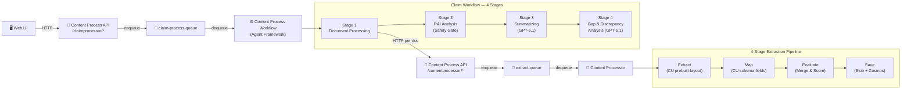
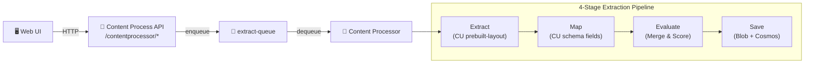
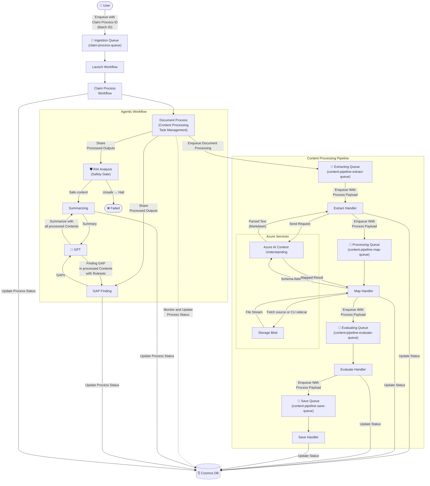

## Technical Architecture

Additional details about the technical architecture of the Claims Intelligence project. This describes the purpose and additional context of each component in the solution.

### End-to-End Processing Flow

The solution supports two processing paths, both routed through the **Content Process API**:

#### Path 1 — Claim Batch Processing (multi-document)

#### Path 2 — Single Document Processing

For detailed workflow documentation, see [Claim Processing Workflow](./ClaimProcessWorkflow.md). For the 4-stage document extraction pipeline, see [Processing Pipeline Approach](./ProcessingPipelineApproach.md).

### Claim Processing — Detailed Process Flow

The diagram below shows the complete end-to-end claim processing flow, including all queues, services, and data stores.

**Key flow**:

1. A user enqueues a claim (batch ID) to the **Ingestion Queue**
2. The **Claim Process Workflow** launches and registers the **Agentic Workflow** (4 stages)
3. **Stage 1 — Document Process**: For each document, enqueues to the **Content Processing Pipeline** (Extract → Map → Evaluate → Save), each step using its own queue
4. **Stage 2 — RAI Analysis**: Screens extracted content through the LLM safety classifier; halts on unsafe content
5. **Stage 3 — Summarizing**: Sends all processed content to GPT for consolidated summarization
6. **Stage 4 — GAP Finding**: Sends processed content + YAML rulesets to GPT for gap/discrepancy analysis
7. Every stage updates **Cosmos DB** with processing status

### Container Registry
Using Azure Container Registry, container images are built, stored, and managed in a private registry. These container images include the Content Processor, Content Process API, Claim Process Monitor Web, and Content Process Workflow (Claim Processor).

### Naming Conventions

The solution uses slightly different names across source code directories, Docker images, and Azure Container Apps. The table below maps each service to its canonical names:

| Service | Source Directory | Docker Image | Container App | Notes |
|---|---|---|---|---|
| Content Processor | `src/ContentProcessor` | `contentprocessor` | `ca-<suffix>-app` | 4-stage document extraction pipeline |
| Content Process API | `src/ContentProcessorAPI` | `contentprocessorapi` | `ca-<suffix>-api` | Central API gateway |
| Content Process Workflow | `src/ContentProcessorWorkflow` | `contentprocessworkflow` | `ca-<suffix>-wkfl` | Agent Framework claim orchestration |
| Claims Demo UI | `src/ContentProcessorClaimsDemo` | `contentprocessorclaimsdemo` | `ca-<suffix>-claims` | Vite/React/TypeScript claims-journey demo frontend |

> **Note:** `<suffix>` is a unique string generated during deployment (the `solutionSuffix` Bicep parameter).

### Service - Content Processor
Internal container app for document processing pods. This service runs a multi-step pipeline (Extract → Map → Evaluate → Save) that consumes jobs from Azure Storage Queue, processing individual documents through Azure AI Content Understanding analyzers and schema-field extraction.

### Service - Content Process Workflow (Claim Processor)
Internal queue-driven container app that orchestrates claim-level batch processing workflows. This service is built on the **Agent Framework's Workflow Engine** — a DAG-based event-streaming execution model using `WorkflowBuilder` and `Executor` patterns. The workflow runs a four-stage linear pipeline:
1. **Document Processing** – For each document in the claim, invokes the Content Process API's content processor endpoints, which in turn triggers the Content Processor's 4-stage extraction pipeline. Polls for completion and collects extraction results with confidence scores.
2. **RAI Analysis** – Responsible AI safety gate that screens all extracted content through an LLM-based classifier. Blocks the pipeline if content is flagged as unsafe.
3. **Summarizing** – Uses Azure OpenAI Service GPT-5.1 to generate consolidated summaries of the processed claim documents.
4. **Gap Analysis** – Uses Azure OpenAI Service GPT-5.1 to perform gap analysis across the claim documents, identifying missing or inconsistent information.

The workflow reads claim processing requests from Azure Storage Queue (`claim-process-queue`) with support for concurrent workers, retry logic with exponential backoff, dead-letter queues, and graceful shutdown. For full details, see [Claim Processing Workflow](./ClaimProcessWorkflow.md).

### Content Process API (Claim Process API)
Using Azure Container App, this is the central API gateway for the solution. It exposes two sets of endpoints:
- **Workflow endpoints** (`/claimprocessor/*`) – Used by the Web UI for claim lifecycle management (create claim, add files, start processing, get status/results).
- **Content processor endpoints** (`/contentprocessor/*`) – Used by the Content Process Workflow to submit individual documents for extraction processing.

The API also provides schema management, schema set (collection) management, and processing queue datasets. Swagger and Open API specifications are available for the APIs.

#### Claims Demo Policy Grounding

The claims-journey recommendation step uses two separate Azure AI Search indexes:

- `member-policies-idx` stores member-held auto policy contracts. This is the authoritative source for policy status, policy period, covered VINs, deductibles, endorsements, exclusions, and named insureds. The API resolves this index server-side by exact policy number before invoking the recommendation agent.
- `claim-policies-idx` stores claims-handling guidance and procedure documents. This is advisory knowledge for how an adjuster should handle a scenario after the member policy facts are known. It must not be treated as proof that the member has coverage.

Both indexes are seeded from `infra/sample-policies`, but from separate folders and separate seed endpoints. Fresh deployments should preserve that separation so a missing member policy cannot be papered over by a generic handling playbook.

### Claim Process Monitor Web
Using Azure Container App, this app acts as the UI for the process monitoring queue. The app is built with React and TypeScript. It acts as an API client to create an experience for uploading new documents, creating and managing claim batches, monitoring current and historical processes, and reviewing output results including summarization and gap analysis.

### App Configuration
Using Azure App Configuration, app settings and configurations are centralized and used with the Content Processor, Content Process API, Content Process Workflow, and Claim Process Monitor Web.

### Storage Queue
Using Azure Storage Queue, pipeline work steps and processing jobs are added to storage queues to be picked up and run by their respective services. The solution uses a **dynamic naming convention** for pipeline queues and dedicated queues for claim workflow orchestration:

**Content Processor pipeline queues** — generated from the pattern `content-pipeline-{step}-queue` based on the configured pipeline steps (`extract`, `map`, `evaluate`, `save`):

| Queue | Dead-Letter Queue | Purpose |
|---|---|---|
| `content-pipeline-extract-queue` | `content-pipeline-extract-queue-dead-letter-queue` | Document extraction (AI Content Understanding) |
| `content-pipeline-map-queue` | `content-pipeline-map-queue-dead-letter-queue` | Schema-field extraction and mapping |
| `content-pipeline-evaluate-queue` | `content-pipeline-evaluate-queue-dead-letter-queue` | Merge & confidence scoring |
| `content-pipeline-save-queue` | `content-pipeline-save-queue-dead-letter-queue` | Persist results to Blob + Cosmos DB |

**Claim Workflow queues** — used by the Content Process Workflow (Agent Framework):

| Queue | Purpose |
|---|---|
| `claim-process-queue` | Claim batch processing workflow requests |
| `claim-process-dead-letter-queue` | Failed claim messages after retry exhaustion |

### Azure AI Content Understanding Service
Used to detect layout, text, and schema fields from images and PDFs. The demo uses `prebuilt-layout` plus self-healing linked analyzers for Auto Claim routing and per-document extraction; Foundry vision is only a classification safety net when Content Understanding cannot confidently route a file.

### Azure OpenAI Service
Using Azure OpenAI Service, a deployment of the GPT-5.1 model is used for Responsible AI screening, claim summarization, gap analysis, and the Claims Demo journey agents. This model can be changed to a different Azure OpenAI Service model if desired, but this has not been thoroughly tested and may be affected by the output token limits.

### Blob Storage
Using Azure Blob Storage, the solution uses multiple containers:
- **process-batch** – Claim batch manifests and batch-level artifacts.
- **cps-processes** – Source files for processing, intermediate results, and final output JSON files.
- **cps-configuration** – Schema `.py` files and configuration data.

### Azure Cosmos DB for MongoDB
Using Azure Cosmos DB for MongoDB, the solution uses multiple collections:
- **Processes** – Individual document processing records with status, step history, extraction results, and confidence scores.
- **Schemas** – Registered schema definitions.
- **Schemasets** – Schema set (collection) configurations that group schemas for claim processing.
- **claimprocesses** – Claim batch processing records with workflow status, processed documents, summarization, and gap analysis results.
- **batches** – Batch processing metadata.
- **checkpoints** – Agent Framework workflow execution checkpoints for fault tolerance.

The processing queue stores individual processes information and history for status and processing step review, along with final extraction and transformation into JSON for its selected schema.
